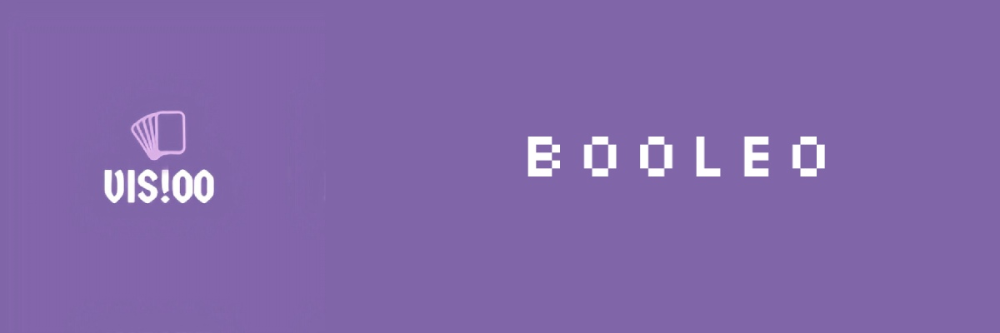

 

  

  

   
   
   
   
  

  <h1>✍🏽Description </h1>
  Vis!00 is a newly formed team made up from 4 team members. The goal of the team is to create a game based on boolean logic.You can learn about the rules of the game and about us on our in game menu our in our website-(link for the website)
  <h1>🤝 Our Team </h1>
  

  
1. **Lubomir Georgiev** - **Scrum trainer**	
   > ***GitHub profile***: [***LRGeorgiev***](https://github.com/LRGeorgiev)	

2. **Ivailo Stoqnov** - **Backend Developer** 
   > ***GitHub profile***: [***IPStoyanov20***](https://github.com/IPStoyanov20)	

3. **Georgi Kotakov** - **Backend Developer** 
   > ***GitHub profile***: [***GGKotakov20***](https://github.com/ggkotakov20)	

4. **Denislav Bratoevski** - **QA engineer** 
   > ***GitHub profile***: [***DGBratoevski20***](https://github.com/DGBratoevski20)
  

  <h1>🚀Apps and Languages </h1>
  
  
  
  
  <h1>📝Documents</h1>
 <h2> <a href = "">📄Documentation</h2>
 <h2> <a href = "">✅ QA Documentation</h2>
 <h2> <a href = "">🖥Presentation</h2>
 
  