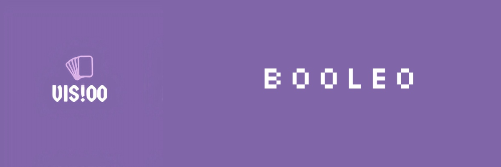

 

  

  

   
   
   
   
  

  <h1>✍ Description </h1>
  Vis!00 is a newly formed team made up from 4 team members. The goal of the team is to create a game based on boolean logic.You can learn about the rules of the game and about us on our in-game menu or in our website-(link for the website)
  <h1>🤝 Our Team </h1>
  

  
1. **Lubomir Georgiev** - **Scrum trainer**	
   > ***GitHub profile***: [***LRGeorgiev***](https://github.com/LRGeorgiev)	

2. **Ivailo Stoyanov** - **Backend Developer** 
   > ***GitHub profile***: [***IPStoyanov20***](https://github.com/IPStoyanov20)	

3. **Georgi Kotakov** - **Backend Developer** 
   > ***GitHub profile***: [***GGKotakov20***](https://github.com/ggkotakov20)	

4. **Denislav Bratoevski** - **QA engineer** 
   > ***GitHub profile***: [***DGBratoevski20***](https://github.com/DGBratoevski20)
   
    **Veselin Stoyanov** - **Mentor** 
   > ***GitHub profile***: [***VNStoyanov19***](https://github.com/VNStoyanov19)
  

 
  
  https://github.com/VNStoyanov19
  
  <h1>🚀 Used technologies</h1>
  
 
	 
	<a>
	
	
	
	
	
	
	
	

  

	
   
   <h1>📝 Documents</h1>
  

 <h2> <a href ="https://codingburgas-my.sharepoint.com/:w:/g/personal/lrgeorgiev20_codingburgas_bg/EQswmcNHcOZIllFhnMwmtpAB-qKBlkdls-xRkXk4aPpUqg?e=vjo646" >📄 Documentation</h2>
 <h2> <a href = "https://codingburgas-my.sharepoint.com/:w:/g/personal/dgbratoevski20_codingburgas_bg/EZNZpDGCn4RKknmbAVoTAXABegIt23XjsAGL9s-RWKI6Kg?e=yJHJX6">✅ QA Documentation</h2>
 <h2> <a href ="https://codingburgas-my.sharepoint.com/:p:/g/personal/lrgeorgiev20_codingburgas_bg/EZ9LC5jyO8RPtWhY3-b4BacBjY44az4qdxXADWmcp69QNQ?e=xWp5Sm" >🖥 Presentation</h2>

	
	
## ***If you like our project you can 🌟 us!***
	 
